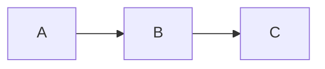

[](https://ci-cd.platypush.tech/blacklight/madblog)
[](https://git.platypush.tech/blacklight/madblog/issues)
[](https://github.com/blacklight/madblog)
[](https://github.com/blacklight/madblog)
[](https://git.fabiomanganiello.com/madblog/commits/branch/main)

[](https://git.fabiomanganiello.com/madblog/src/branch/main/LICENSE.txt)
[](https://pypi.python.org/pypi/madblog/)
[](https://app.codacy.com/gh/blacklight/madblog/dashboard?utm_source=gh&utm_medium=referral&utm_content=&utm_campaign=Badge_grade)
[](https://github.com/sponsors/blacklight)

<!--TOC-->

- [Demos](#demos)
- [Quickstart](#quickstart)
- [Installation](#installation)
  - [Local installation](#local-installation)
  - [Full local installation](#full-local-installation)
  - [Docker installation](#docker-installation)
    - [Minimal Docker installation](#minimal-docker-installation)
      - [Pre-built image (recommended)](#pre-built-image-recommended)
      - [Build from source](#build-from-source)
    - [Full Docker installation](#full-docker-installation)
- [Usage](#usage)
  - [Running Madblog from a uWSGI wrapper](#running-madblog-from-a-uwsgi-wrapper)
  - [Running Madblog in Docker](#running-madblog-in-docker)
- [Markdown files](#markdown-files)
- [Configuration](#configuration)
  - [Server settings](#server-settings)
  - [Site metadata](#site-metadata)
  - [Author settings](#author-settings)
  - [External links](#external-links)
  - [Feed settings](#feed-settings)
  - [Email notifications](#email-notifications)
  - [Webmentions](#webmentions)
  - [Moderation](#moderation)
    - [Blocklist mode](#blocklist-mode)
    - [Allowlist mode](#allowlist-mode)
    - [Moderation behavior](#moderation-behavior)
  - [Guestbook](#guestbook)
  - [Visibility](#visibility)
    - [Configuration](#configuration-1)
    - [Per-post visibility](#per-post-visibility)
    - [Visibility levels](#visibility-levels)
    - [Unlisted replies](#unlisted-replies)
  - [View mode](#view-mode)
  - [Aggregator mode](#aggregator-mode)
  - [Tags](#tags)
  - [Raw Markdown](#raw-markdown)
  - [Folders](#folders)
    - [URL scheme](#url-scheme)
    - [Navigation](#navigation)
    - [Folder metadata with `index.md`](#folder-metadata-with-indexmd)
    - [Hidden and empty folders](#hidden-and-empty-folders)
    - [External feeds as folders](#external-feeds-as-folders)
- [Author Replies](#author-replies)
  - [Directory layout](#directory-layout)
  - [Reply metadata](#reply-metadata)
  - [Types of replies](#types-of-replies)
  - [How threading works](#how-threading-works)
  - [Federation](#federation)
  - [Routes](#routes)
  - [Author Reactions](#author-reactions)
    - [Liking a post](#liking-a-post)
    - [Standalone likes vs. combined posts](#standalone-likes-vs-combined-posts)
    - [Rendering](#rendering)
    - [Limitations](#limitations)
- [Images](#images)
- [LaTeX support](#latex-support)
- [Mermaid diagrams](#mermaid-diagrams)
  - [Installation](#installation-1)
    - [Option A: pip extra (recommended)](#option-a-pip-extra-recommended)
    - [Option B: System Node.js](#option-b-system-nodejs)
  - [Usage](#usage-1)
- [ActivityPub federation](#activitypub-federation)
  - [Using a different domain for your ActivityPub handle](#using-a-different-domain-for-your-activitypub-handle)
  - [Mentions](#mentions)
  - [Configuration options](#configuration-options)
  - [Mastodon verification](#mastodon-verification)
  - [Mastodon-compatible API](#mastodon-compatible-api)
- [Feed syndication](#feed-syndication)
  - [Guestbook feed](#guestbook-feed)
- [PWA](#pwa)

<!--TOC-->

A minimal but capable blog and Web framework that you can directly run from a Markdown folder.

Features:

- **No database required**: just a folder with your Markdown files. An Obsidian
  vault, a Nextcloud Notes folder or share point, a git clone, a folder on your
  phone synchronized over SyncThing...it can be anything.

- **LaTeX support**: support for rendering LaTeX equations in your Markdown
  files.

- **Mermaid support**: support for rendering Mermaid diagrams in your Markdown
  files.

- **Webmentions support**: native support for
  [Webmentions](https://indieweb.org/Webmentions). Get mentioned by other blogs
  or link aggregators, and receive notifications and replies rendered on your
  own blog.

- **ActivityPub support**: native support for
  [ActivityPub](https://indieweb.org/ActivityPub). Get mentioned by other
  ActivityPub servers, get followers for your blog from Mastodon and other
  Fediverse instances, and receive notifications and replies rendered on your
  own blog. It also comes with a sensible implementation of the Mastodon API.

- **File-based syndication**: no intermediate APIs, databases or services.
  No heavy polling nor synchronization. Everything is based on plain text files
  and file system events. Updating your articles is as simple as editing a
  Markdown file on your server. Wanna mention someone? Just put their website
  or ActivityPub handle in your file, and they'll get a notification. Wanna
  clean up your ActivityPub events? Just remove a JSON file.

- **Guestbook mode**: a dedicated page that aggregates public mentions to your
  website and interactions from across the web.

- **Aggregator mode**: render external RSS or Atom feeds directly in your blog.
  Great for affiliated blogs, or even self-hosted news readers.

- **Flexible moderation**: smart moderation rules can be set on domains,
  usernames, URLs, with support for regular expressions.

- **Tags and categories**: organize your content with hashtags in your articles.
  Folders on the filesystem are categories.

## Demos

This project powers the following blogs:

- [Platypush](https://blog.platypush.tech)
- [My personal blog](https://blog.fabiomanganiello.com)

## Quickstart

```
mkdir -p ~/madblog/markdown
cat <<EOF >~/madblog/markdown/article-1.md
# My first article

This is my first article!

Welcome to [Madblog](https://git.fabiomanganiello.com/madblog)!
EOF

docker run -it \
  -p 8000:8000 \
  -v "$HOME/madblog:/data" \
  quay.io/blacklight/madblog
```

Then open [http://localhost:8000](http://localhost:8000)

## Installation

### Local installation

A base installation includes everything (including Webmentions and
ActivityPub support) except LaTeX and Mermaid.

```shell
pip install madblog
```

### Full local installation

- **Latex support**: requires any installation that provides `latex` and
  `dvipng` (and preferably some good math fonts) on your system.
- **Mermaid support**: requires `mermaid-cli` on your system, or `npx` so
  Madblog can install it for you.

### Docker installation

#### Minimal Docker installation

A minimal installation doesn't include extra plugins (but it still include
support for Webmentions and ActivityPub), and it aims to always be less than
100 MB in size.

##### Pre-built image (recommended)

```bash
docker pull quay.io/blacklight/madblog
docker tag quay.io/blacklight/madblog madblog
```

##### Build from source

```shell
git clone https://git.fabiomanganiello.com/madblog
cd madblog
docker build -f docker/minimal.Dockerfile -t madblog .
```

#### Full Docker installation

Includes all plugins - including LaTeX and Mermaid; &gt; 2 GB in size.

```shell
git clone https://git.fabiomanganiello.com/madblog
cd madblog
docker build -f docker/full.Dockerfile -t madblog .
```

## Usage

```shell
# The application will listen on port 8000 and it will
# serve the current folder
$ madblog
usage: madblog [-h] [--config CONFIG] [--host HOST] [--port PORT] [--debug] [dir]
```

Recommended setup (for clear separation of content, configuration and static
files):

```
.
  -> config.yaml [recommended]
  -> markdown
    -> article-1.md
    -> article-2.md
    -> ...
  -> img [recommended]
    -> favicon.ico
    -> icon.png
    -> image-1.png
    -> image-2.png
    -> ...
```

But the application can run from any folder that contains Markdown files
(including e.g. your Obsidian vault, Nextcloud Notes folder or a git clone).

### Running Madblog from a uWSGI wrapper

Running Madblog directly from the command-line is fine for tests and very
low-traffic use-cases, but for production you should run it from a uWSGI
wrapper.

Running it in Gunicorn:

```bash
# Note that a custom configuration file is passed via environment variable
# in this case, to prevent clashes with gunicorn's own `--config` option.
# In this case we bind to 127.0.0.1:8000, with 8 workers and a 5s timeout
MADBLOG_CONFIG=/your/config.yaml \
  gunicorn -w 8 -b 127.0.0.1:8000 madblog.uwsgi \
  /your/content
```

### Running Madblog in Docker

To run it from Docker:

```shell
docker run -it \
  -p 8000:8000 \
  -v "/path/to/your/config.yaml:/etc/madblog/config.yaml" \
  -v "/path/to/your/content:/data" \
  madblog
```

If you have ActivityPub federation enabled, mount your private key and
the state directory for persistence:

```shell
docker run -it \
  -p 8000:8000 \
  -v "/path/to/your/config.yaml:/etc/madblog/config.yaml" \
  -v "/path/to/your/content:/data" \
  -v "/path/to/your/private_key.pem:/etc/madblog/ap_key.pem:ro" \
  -v "/path/to/your/state:/data/.madblog" \
  madblog
```

Or pass the configuration directory where `config.yaml` lives as a volume
to let Madblog create a key there on the first start:

```shell
docker run -it \
  -p 8000:8000 \
  -v "/path/to/your/config:/etc/madblog" \
  -v "/path/to/your/content:/data" \
  -v "/path/to/your/state:/data/.madblog" \
  madblog
```

Set `activitypub_private_key_path: /etc/madblog/ap_key.pem` in your
`config.yaml`. The key file must be readable only by the owner (`chmod 600`).

## Markdown files

Metadata for articles is stored directly in the Markdown files, as comments in
the format:

```markdown
[//]: # (key: value)
```

Supported metadata:

| Key | Type | Default |
|-----|------|---------|
| `title` | String | Inferred either from the first heading or the filename |
| `description` | String | Inferred from the second heading, if present |
| `image` | String | — |
| `author` | String | Inherited from the configured `author` |
| `author_photo` | String | Inherited from the configured `author_photo` |
| `language` | String | Inherited from the configured `language` or `en-US` |
| `published` | Date | Inferred from the creation time of the file |
| `tags` | List of strings | — |


Example Markdown header:

```markdown
[//]: # (title: Title of the article)
[//]: # (description: Short description of the content)
[//]: # (image: /img/some-header-image.png)
[//]: # (author: Author Name <https://author.me>)
[//]: # (author_photo: https://author.me/avatar.png)
[//]: # (language: en-US)
[//]: # (published: 2022-01-01)

...your article goes here...
```

Or, if you want to pass an email rather than a URL for the author:

```markdown
[//]: # (author: Author Name <mailto:email@author.me>)
```

Optional:

```markdown
[//]: # (title: Title of the article)
[//]: # (description: Short description of the content)
[//]: # (image: /img/some-header-image.png)
[//]: # (author: Author Name <https://author.me>)
[//]: # (author_photo: https://author.me/avatar.png)
[//]: # (language: en-US)
[//]: # (published: 2022-01-01)
```

You can also tag your articles:

```markdown
[//]: # (tags: #python, #webdev, #tutorial)
```

Tags declared in the metadata header are shown in the article header as links and
contribute to the tag index available at `/tags`. Hashtags written directly in the
article body (e.g. `#python`) are also detected and rendered as links to the
corresponding tag page.

## Configuration

See [config.example.yaml](./config.example.yaml) for an example configuration
file, and copy it to `config.yaml` in your blog root directory to customize
your blog.

All the configuration options are also available as environment variables, with
the prefix `MADBLOG_`.

For example, the `title` configuration option can be set through the `MADBLOG_TITLE`
environment variable.

### Server settings

| Option | Env var | Default | Description |
|--------|---------|---------|-------------|
| `host` | `MADBLOG_HOST` | `0.0.0.0` | Listening address for the built-in web server. |
| `port` | `MADBLOG_PORT` | `8000` | Listening port for the built-in web server. |
| `content_dir` | `MADBLOG_CONTENT_DIR` | `.` | Path to the directory containing blog posts and assets. |
| `state_dir` | `MADBLOG_STATE_DIR` | `<content_dir>/.madblog` | Path to the state directory where Madblog stores ActivityPub data, webmentions, and caches. |

### Site metadata

| Option | Env var | Default | Description |
|--------|---------|---------|-------------|
| `title` | `MADBLOG_TITLE` | — | Title of the blog (strongly recommended). |
| `description` | `MADBLOG_DESCRIPTION` | — | Short description of the blog. |
| `link` | `MADBLOG_LINK` | — | Public base URL of the blog (required for Webmentions and ActivityPub). |
| `home_link` | `MADBLOG_HOME_LINK` | unset (uses `link`) | URL for the "Home" link in the header, if different from `link`. |
| `logo` | `MADBLOG_LOGO` | — | URL to a logo image for the blog. |
| `language` | `MADBLOG_LANGUAGE` | `en-US` | Default language for the blog (can be overridden per article). |
| `header` | `MADBLOG_HEADER` | `true` | Whether to show the blog header in generated pages. |

### Author settings

| Option | Env var | Default | Description |
|--------|---------|---------|-------------|
| `author` | `MADBLOG_AUTHOR` | — | Default author name when not specified in article metadata. |
| `author_url` | `MADBLOG_AUTHOR_URL` | — | Default author URL (supports `mailto:` links). |
| `author_photo` | `MADBLOG_AUTHOR_PHOTO` | — | Default author photo URL. |
| `author_email` | `MADBLOG_AUTHOR_EMAIL` | — | Author email address for mention notifications. |

### External links

You can add external profile links that will be rendered as `<link rel="me">` on
each page, useful for profile verification:

```yaml
external_links:
  - https://mastodon.social/@myprofile
  - https://github.com/myprofile
```

Or via environment variable (comma-separated):

```shell
export MADBLOG_EXTERNAL_LINKS="https://mastodon.social/@myprofile,https://github.com/myprofile"
```

### Feed settings

| Option | Env var | Default | Description |
|--------|---------|---------|-------------|
| `short_feed` | `MADBLOG_SHORT_FEED` | `false` | If true, feeds contain only article descriptions instead of full content. |
| `max_entries_per_feed` | `MADBLOG_MAX_ENTRIES_PER_FEED` | `10` | Maximum number of entries returned by RSS/Atom feeds. |
| `feeds_cache_expiry_secs` | `MADBLOG_FEEDS_CACHE_EXPIRY_SECS` | `300` | Cache duration for external feeds (in seconds). Set to `0` to disable caching. |

### Email notifications

Madblog can send email notifications when new Webmentions or ActivityPub
interactions are received. Configure SMTP settings to enable this:

| Option | Env var | Default | Description |
|--------|---------|---------|-------------|
| `smtp_server` | `MADBLOG_SMTP_SERVER` | — | SMTP server hostname. |
| `smtp_port` | `MADBLOG_SMTP_PORT` | `587` | SMTP server port. |
| `smtp_username` | `MADBLOG_SMTP_USERNAME` | — | SMTP authentication username. |
| `smtp_password` | `MADBLOG_SMTP_PASSWORD` | — | SMTP authentication password. |
| `smtp_starttls` | `MADBLOG_SMTP_STARTTLS` | `true` | Use STARTTLS for SMTP connection. |
| `smtp_enable_starttls_auto` | `MADBLOG_SMTP_ENABLE_STARTTLS_AUTO` | `true` | Automatically enable STARTTLS if supported. |

### Webmentions

Webmentions allow other sites to notify your blog when they link to one of your
articles. Madblog exposes a Webmention endpoint and stores inbound mentions under
your `content_dir`.

Madblog uses [Webmentions](https://git.fabiomanganiello.com/webmentions) to
handle Webmentions ([blog
article](https://blog.fabiomanganiello.com/article/webmentions-with-batteries-included)),
a Python framework I build originally for Madblog itself but that can be used
to easily enable support for Webmentions on any Python Web application.

> **NOTE**: It is advised to explicitly _disable_ Webmentions (set
> `enable_webmentions: false`, or `MADBLOG_ENABLE_WEBMENTIONS=0`) if you run
> Madblog on e.g. your local machine or a development environment. Otherwise
> each time a Markdown file is saved some notifications to an invalid URL may
> actually be dispatched to real Web sites.

Webmentions configuration options:

- **Enable/disable**
  - Config file: `enable_webmentions: true|false`
  - Environment variable: `MADBLOG_ENABLE_WEBMENTIONS=1` (enable) or `0` (disable)

- **Site link requirement**
  - Set `link` (or `MADBLOG_LINK`) to the public base URL of your blog.
  - Incoming Webmentions are only accepted if the `target` URL domain matches the
    configured `link` domain.

- **Endpoint**
  - The Webmention endpoint is available at: `/webmentions`.

- **Storage**
  - Inbound Webmentions are stored as Markdown files under:
    `<state_dir>/mentions/incoming/<post-slug>/` (default: `<content_dir>/.madblog/mentions/...`).

Additional Webmentions options:

| Option | Env var | Default | Description |
|--------|---------|---------|-------------|
| `webmentions_hard_delete` | `MADBLOG_WEBMENTIONS_HARD_DELETE` | `false` | If true, deleted Webmentions are removed from disk; otherwise they are marked as deleted. |
| `webmentions_default_status` | `MADBLOG_WEBMENTIONS_DEFAULT_STATUS` | `confirmed` | Default status for incoming Webmentions (`confirmed` or `pending`). Pending mentions require manual approval. |

### Moderation

Madblog supports moderation rules that apply to both incoming Webmentions
and ActivityPub interactions. There are two mutually exclusive modes:

- **Blocklist mode** (`blocked_actors`): actors matching patterns are rejected.
- **Allowlist mode** (`allowed_actors`): only actors matching patterns are
  permitted; all others are rejected.

**You cannot enable both modes at the same time.** The application will raise
an error at startup if both `blocked_actors` and `allowed_actors` are configured.

Each entry in either list can be:

- **Domain**: e.g. `trusted.example.com` — matches all URLs/actors from that domain.
- **Full URL**: e.g. `https://mastodon.social/users/friend` — matches that exact actor.
- **ActivityPub FQN**: e.g. `@friend@mastodon.social` or `friend@mastodon.social` — matches that federated identity by domain + username in the actor URL.
- **Regular expression**: delimited by `/`, e.g. `/trusted\.example\..*/` — matched against the full source URL or actor ID.

#### Blocklist mode

Block specific actors while allowing everyone else:

```yaml
# config.yaml
blocked_actors:
  - spammer.example.com
  - "@troll@evil.social"
  - /spam-ring\.example\..*/
```

Or via environment variable (comma- or space-separated):

```shell
export MADBLOG_BLOCKED_ACTORS="spammer.example.com,@troll@evil.social"
```

#### Allowlist mode

Allow only specific actors while blocking everyone else:

```yaml
# config.yaml
allowed_actors:
  - trusted-friend.example.com
  - "@friend@good.social"
  - /.*\.trusted-org\.com/
```

Or via environment variable:

```shell
export MADBLOG_ALLOWED_ACTORS="trusted-friend.example.com,@friend@good.social"
```

#### Moderation behavior

Interactions already stored before a moderation rule was added are also filtered
at render time, so they will no longer appear on your pages.

For ActivityPub, moderation also affects **outgoing** delivery: followers not
permitted by the current rules are excluded from fan-out (they will not receive
new posts) and are hidden from the public follower count. The follower records
are kept on disk with a `"blocked"` marker so they can be restored automatically:

- **Blocklist mode**: if you remove a blocklist entry that matched a follower,
  the follower is reinstated on the next application start.
- **Allowlist mode**: if you add an allowlist entry that now matches a previously
  blocked follower, or if you remove the allowlist entirely, the follower is
  reinstated.

The moderation lists are cached in memory with a 5-minute TTL to avoid filesystem
round-trips during publish.

### Guestbook

The guestbook feature provides a dedicated page (`/guestbook`) that aggregates
public mentions and interactions from across the web, serving as a "guest
registry" for your blog.

Guestbook entries are collected from two sources:

- **Webmentions** targeting the home page (when `enable_webmentions` is enabled)
- **ActivityPub mentions** of your blog actor that are not replies to articles
  (when `enable_activitypub` is enabled)

The guestbook is enabled by default. To disable it:

```yaml
# config.yaml
enable_guestbook: false
```

Or via environment variable:

```shell
export MADBLOG_ENABLE_GUESTBOOK=0
```

When enabled, a "Guestbook" link appears in the navigation menu. The page
displays messages chronologically (most recent first). Blocked actors (via
`blocked_actors`) are automatically filtered out.

**How visitors can leave a message:**

- **Via Webmention:** Send a Webmention with your blog's home page URL as the
  target.
- **Via Fediverse:** Mention your blog's ActivityPub handle (e.g.
  `@blog@example.com`) in a public post that is not a reply to one of your
  articles.

### Visibility

Posts (articles and replies) can have different visibility levels that control
where they appear and how they are federated via ActivityPub.

#### Configuration

Set the default visibility for all posts:

```yaml
# config.yaml
default_visibility: public  # or: unlisted, followers, direct, draft
```

Or via environment variable:

```shell
export MADBLOG_DEFAULT_VISIBILITY=public
```

#### Per-post visibility

Override visibility for individual posts using metadata:

```markdown
[//]: # (visibility: unlisted)

# My Unlisted Post

This post won't appear in the index but can be accessed directly.
```

#### Visibility levels

| Level | Blog Index | `/unlisted` Page | Reactions | ActivityPub | Direct URL |
|-------|------------|------------------|-----------|-------------|------------|
| `public` | ✓ | ✗ | ✓ | `to: [Public]`, `cc: [followers]` | ✓ |
| `unlisted` | ✗ | ✓ | ✓ | `to: [followers]`, `cc: [Public]` | ✓ |
| `followers` | ✗ | ✗ | ✗ | `to: [followers]`, `cc: []` | ✓ |
| `direct` | ✗ | ✗ | ✗ | `to: [mentions]`, `cc: []` | ✓ |
| `draft` | ✗ | ✗ | ✗ | Not federated | ✓ |

- **public**: Appears in the blog index and RSS/Atom feeds. Federated publicly.
- **unlisted**: Not in index/feeds, but listed on `/unlisted`. Federated to followers with Public in CC.
- **followers**: Only visible via direct URL. Federated to followers only.
- **direct**: Only visible via direct URL. Federated only to mentioned actors.
- **draft**: Only visible via direct URL. Not federated at all (for previewing before publishing).

#### Unlisted replies

Root-level replies (files directly in `replies/` without `reply-to` or `like-of`
metadata) default to `unlisted` visibility for backward compatibility. They
appear on the `/unlisted` page unless explicitly given a different visibility.

### View mode

The blog home page supports three view modes:

- **`cards`** (default): A responsive grid of article cards with image, title, date and description.
- **`list`**: A compact list — each entry shows only the title, date and description.
- **`full`**: A scrollable, WordPress-like view with the full rendered content of each article inline.

You can set the default via config file or environment variable:

```yaml
# config.yaml
view_mode: cards  # or "list" or "full"
```

```shell
export MADBLOG_VIEW_MODE=list
```

The view mode can also be overridden at runtime via the `view` query parameter:

```
https://myblog.example.com/?view=list
https://myblog.example.com/?view=full
```

Invalid values are silently ignored and fall back to the configured default.

### Aggregator mode

Madblog can also render external RSS or Atom feeds directly in your blog.

Think of cases like the one where you have multiple blogs over the Web and you
want to aggregate all of their content in one place. Or where you have
"affiliated blogs" run by trusted friends or other people in your organization
and you also want to display their content on your own blog.

Madblog provides a simple way of achieving this by including the
`external_feeds` section in your config file:

```yaml
# config.yaml
external_feeds:
  - https://friendsblog.example.com/feed.atom
  - https://colleaguesblog.example.com/feed.atom
```

### Tags

Madblog provides a tag index at `/tags` that lists all tags used across your
articles. Each tag links to `/tags/<tag>`, which shows all articles tagged with
that hashtag.

Tags are extracted from:

- The `tags` metadata field (comma-separated)
- Hashtags in the title, description, or body text
- Hashtags in incoming Webmentions for the article

### Raw Markdown

You can retrieve the raw Markdown source of any article by appending `.md` to
the article URL:

```
https://myblog.example.com/article/my-post.md
```


### Folders

You can organize Markdown files in folders within `pages_dir`. Folders provide
hierarchical navigation for your content.

#### URL scheme

- **Folder index**: `/~folder/` or `/~folder/subfolder/`
- **Per-folder feeds**: `/~folder/feed.rss`, `/~folder/feed.atom`
- **Articles**: `/article/folder/article-name`

#### Navigation

- The **home page** shows only root-level articles and folder links
- Each **folder index** shows its direct articles and subfolders
- **Breadcrumb navigation** appears on folder pages
- A **parent link** allows navigating back up the hierarchy

#### Folder metadata with `index.md`

Place an `index.md` file in a folder to customize it:

- **With content**: The file is rendered as the folder's landing page, replacing
  the default listing. Example:

```markdown
[//]: # (title: About Me)
[//]: # (description: Short bio)
[//]: # (image: /img/docs-banner.png)

# About Me

I am a blogger and a Web developer.

My links:

- ...
```

If you place this file under `<pages_dir>/about/index.md`, it will be rendered as
and article at `/~about/`.

- **Metadata only**: Provides title, description, and image for folder cards, but
  it keeps the default listing.

```markdown
[//]: # (title: Documentation)
[//]: # (description: Guides and references)
[//]: # (image: /img/docs-banner.png)

# Welcome to Documentation

This content will be shown instead of the folder listing.
```

#### Hidden and empty folders

- Folders starting with `.` or `_` are hidden (e.g., `.drafts`, `_archive`)
- Empty folders (no articles or visible subfolders) are not displayed

#### External feeds as folders

When `external_feeds_as_folders` is enabled, external RSS/Atom feeds (configured
via `external_feeds`) are displayed as virtual folder entries on the home page
instead of being mixed with local articles. Each feed appears as a folder card
linking directly to the external site.

```yaml
external_feeds_as_folders: true
external_feeds:
  - https://example.com/feed.rss
  - https://another-blog.com/feed.atom
```

Or via environment variable: `MADBLOG_EXTERNAL_FEEDS_AS_FOLDERS=1`

## Author Replies

Madblog supports **author replies** — Markdown files that let the blog
author respond to incoming reactions (Webmentions, ActivityPub
interactions, or other author replies). Replies are stored as plain
Markdown files alongside your content and are federated via ActivityPub
as threaded `Note` objects.

### Directory layout

Replies live under `<content_dir>/replies/`, organized by article slug:

```
<content_dir>/
  replies/
    my-post/
      thanks-alice.md
      follow-up.md
    _guestbook/
      welcome-bob.md
```

- Each subdirectory name matches the slug of the parent article.
- The special `_guestbook` slug is used for replies to guestbook entries.

### Reply metadata

Reply files use the same `[//]: #` metadata format as articles:

```markdown
[//]: # (reply-to: https://mastodon.social/users/alice/statuses/123)

Thanks for the kind words, Alice!
```

Supported metadata keys:

| Key | Required | Description |
|-----|----------|-------------|
| `reply-to` | No | URL of the reaction being replied to (Webmention source, AP `object_id`, or another reply's permalink). If omitted, derived automatically from the directory structure as a reply to the parent article. |
| `like-of` | No | URL of a post you are liking. Publishes a `Like` activity to the Fediverse and renders a like indicator. See [Author Reactions](#author-reactions). |
| `published` | No | Publication date. Inferred from file creation time if absent. |
| `title` | No | Optional title for the reply. |
| `author` | No | Overrides the global `author` setting. |
| `author_url` | No | Overrides the global `author_url` setting. |
| `author_photo` | No | Overrides the global `author_photo` setting. |
| `language` | No | Overrides the global `language` setting. |


### Types of replies

Text files under `<content_dir>/replies/` are treated as author replies and they
will not be rendered on the blog index. Mentions also work, and the rendering
and processing pipeline is the same as for articles.

Madblog supports several types of author replies:

- **Generic replies/posts**: Place the Markdown under `<content_dir>/replies/`
  directly. No `reply-to` metadata means that the post will be rendered on
  ActivityPub as a separate post. Posts under `<content_dir>/replies/` with no
  `reply-to` basically won't be rendered on the blog directly, but they are
  still discoverable by URL and rendered to ActivityPub - it's similar to an
  "**Unlisted**" post on Mastodon.

- **Replies to someone else's posts**: Place the Markdown under
  `<content_dir>/replies/`, and add a `reply-to` metadata header pointing to
  the ActivityPub link or Webmention-compatible URL of the resource you're
  replying to. These posts will be rendered as threaded replies on ActivityPub
  clients.

- **Replies to your own articles**: Place the Markdown under `
  <content_dir>/replies/<post-slug>`, where `<post-slug>` is the slug of the
  post you're replying to (i.e. the name of your file without the `.md`
  extension). If the Markdown is in a nested folder then you'll have to specify
  its relative path too here. These posts will be rendered as author replies on
  your blog article. Note that it's also possible to add replies by placing the
  text files under `<content_dir>/replies` directly, and using `reply-to`
  metadata to point to the permalink of the article you're replying to, but
  it's advised to use the slug hierarchy instead to make lookup faster.

- **Replies to replies to your articles**: Place the Markdown under
  `<content_dir>/replies/<post-slug>`, where `<post-slug>` is the slug of the
  post you're replying to (i.e. the name of your file without the `.md`
  extension). If the Markdown is in a nested folder then you'll have to specify
  its relative path too here. These posts will be rendered as author replies on
  your blog article, under the same parent comment as the original reply.

- **Guestbook posts**: Place the Markdown under
  `<content_dir>/replies/_guestbook/`. These posts will be rendered as replies
  under `/_guestbook/`. Replies to other users' posts are also supported through
  the `reply-to` metadata.

### How threading works

Replies appear inline on the article page, threaded under the reaction
they respond to:

1. The `reply-to` URL is matched against known reaction identities
   (Webmention source URLs, AP interaction `object_id`s, or other reply
   permalinks).
2. If a match is found, the reply is nested under that reaction.
3. If `reply-to` is omitted or points to the article URL, the reply
   appears as a top-level entry.
4. Arbitrary nesting depth is supported (replies to replies).

### Federation

When ActivityPub is enabled, author replies are automatically published
to the Fediverse as `Note` objects with `inReplyTo` set:

- **Create:** saving a new `.md` file under `replies/` triggers a
  `Create` activity.
- **Update:** editing an existing reply triggers an `Update` activity.
- **Delete:** removing the file triggers a `Delete` activity.
- **CC targeting:** when replying to an AP interaction, the original
  author's actor is automatically added to the `cc` list so the reply
  appears as a threaded response on their instance.

Outgoing Webmentions are also sent for any links contained in the reply
body when Webmentions are enabled.

### Routes

| Method | Path | Description |
|--------|------|-------------|
| `GET` | `/reply/<article-slug>/<reply-slug>` | Rendered reply page |
| `GET` | `/reply/<article-slug>/<reply-slug>.md` | Raw Markdown source |

### Author Reactions

Madblog supports **author reactions** — a way to publicly "like" posts on the
Fediverse or elsewhere. Likes are expressed via the `like-of` metadata header
in articles or reply files.

#### Liking a post

Create a Markdown file (either under `replies/` or as a regular article) with
the `like-of` metadata pointing to the URL you want to like:

```markdown
[//]: # (like-of: https://mastodon.social/@alice/123)
[//]: # (published: 2025-01-15)

# Liked
```

When ActivityPub is enabled, saving the file publishes a `Like` activity to the
Fediverse. Deleting or removing the `like-of` line publishes an `Undo Like`.

#### Standalone likes vs. combined posts

- **Standalone like**: A file with `like-of` but no `reply-to` and no body
  content (just a heading) is treated as a pure like. It publishes only a
  `Like` activity (no `Note`), and ActivityPub content negotiation returns the
  `Like` activity JSON directly.

- **Like + reply**: A file with both `like-of` and `reply-to` (or body content)
  publishes **both** a `Like` activity and a `Note` object. This lets you like
  a post and leave a comment at the same time.

#### Rendering

On the **source page** (the article/reply containing `like-of`), a footer shows
the liked URL with a star icon.

On the **target page** (an article that was liked by another of your posts), a
small badge appears indicating the author liked it.

#### Limitations

- Only one `like-of` URL per file is currently supported.
- If you are replying to a Fediverse post, remember to **explicitly mention the
  targets of your reply** or they will not get notified. Fediverse
  implementations like Mastodon and Pleroma/Akkoma usually pre-fill them for
  you from the UI when you reply to a post. But if you control your replies
  through text files you'll need to do it manually.

## Images

Images are stored under `img`. You can reference them in your articles through the following syntax:

```markdown

```

You can also drop your `favicon.ico` under this folder.

## LaTeX support

LaTeX support requires the following executables available in the `PATH`:

- `latex`
- `dvipng`

LaTeX rendering is enabled by default when the dependencies are available. To
explicitly disable it (e.g., to reduce memory usage), set in `config.yaml`:

```yaml
enable_latex: false
```

Or via environment variable:

```shell
export MADBLOG_ENABLE_LATEX=0
```

Syntax for inline LaTeX:

```markdown
And we can therefore prove that \(c^2 = a^2 + b^2\)
```

Syntax for LaTeX expression on a new line:

```markdown
$$
c^2 = a^2 + b^2
$$
```

## Mermaid diagrams

Madblog supports server-side rendering of [Mermaid](https://mermaid.js.org/)
diagrams. Both light and dark theme variants are rendered at build time and
automatically switch based on the reader's system color scheme preference.

Mermaid rendering is enabled by default when the dependencies are available. To
explicitly disable it (e.g., to reduce memory usage from Chromium/Puppeteer),
set in `config.yaml`:

```yaml
enable_mermaid: false
```

Or via environment variable:

```shell
export MADBLOG_ENABLE_MERMAID=0
```

### Installation

#### Option A: pip extra (recommended)

No pre-existing system dependencies required beyond what pip provides:

```shell
pip install "madblog[mermaid]"
```

This installs a bundled Node.js runtime via
[`nodejs-wheel`](https://pypi.org/project/nodejs-wheel/). The Mermaid CLI is
downloaded automatically on first use via `npx`. The first render of a Mermaid
block will be slower; subsequent renders are cached.

#### Option B: System Node.js

If you already have Node.js installed:

```shell
npm install -g @mermaid-js/mermaid-cli
pip install madblog
```

If neither `mmdc` nor `npx` are available at runtime, Mermaid blocks are
rendered as syntax-highlighted code instead.

### Usage

Use standard fenced code blocks with the `mermaid` language tag:

````markdown

````

## ActivityPub federation

Madblog supports [ActivityPub](https://www.w3.org/TR/activitypub/) federation,
allowing your blog posts to appear on Mastodon, Pleroma, and other fediverse
platforms. Followers receive new and updated articles directly in their timelines.

It uses [Pubby](https://git.fabiomanganiello.com/pubby) (also developed by me,
and initially developed for this project) to easily add ActivityPub bindings to
the Web application. Pubby follows the same principles and patterns as
[Webmentions](https://git.fabiomanganiello.com/webmentions), and it aims to
make it easy to enable support for ActivityPub on any Python Web application.

Enable ActivityPub in your `config.yaml` (it's disabled by default):

```yaml
enable_activitypub: true
# Optional: custom path for the private key
# Default: <state_dir>/activitypub/private_key.pem
activitypub_private_key_path: /path/to/private_key.pem
```

Or via environment variables:

```shell
export MADBLOG_ENABLE_ACTIVITYPUB=1
export MADBLOG_ACTIVITYPUB_PRIVATE_KEY_PATH=/path/to/private_key.pem
```

### Using a different domain for your ActivityPub handle

Madblog uses the configured `link` as the public base URL for ActivityPub.

That means:

- The actor handle advertised through WebFinger will be:
  `@activitypub_username@<domain from link>`.
- Actor/object IDs (e.g. `/ap/actor`, `/article/<slug>`) will also be built from
  `link`.

Madblog provides two optional overrides:

- **`activitypub_link`**: Overrides where the ActivityPub actor and objects
  *live* (canonical IDs like `https://<...>/ap/actor`). This is what remote
  instances like Mastodon will typically treat as the authoritative identity.
- **`activitypub_domain`**: Overrides only the WebFinger `acct:` domain
  advertised for the handle (i.e. `acct:user@domain`). This controls how people
  discover the actor when they type `@user@domain`.

In the simplest case, `activitypub_domain` can be inferred from
`activitypub_link` and you only need `activitypub_link`.

If you want the blog to be *browsed* at `https://blog.example.com` and keep
`link` unchanged, but you want the fediverse handle to be `@blog@example.com`,
set:

```yaml
# Keep your canonical blog URL
link: https://blog.example.com

# Publish the ActivityPub actor and objects on a different base URL
activitypub_link: https://example.com

# Optional: if omitted, the handle domain defaults to the hostname of
# activitypub_link
activitypub_domain: example.com

# Optional: what the UI header “Home” link points to
home_link: https://blog.example.com

enable_activitypub: true
activitypub_username: blog
```

And then serve the same Madblog instance on both hostnames (typical setup is a
reverse-proxy with two server names pointing to the same upstream).

In this configuration, `example.com` must serve WebFinger for the handle.
You can keep serving `example.com` with a different application and only
delegate the *discovery endpoints* to Madblog (or implement them yourself).
At minimum, `example.com` must serve:

- `/.well-known/webfinger` (required for `@user@example.com` discovery)

Some remote software may also query:

- `/.well-known/nodeinfo`

In this split-domain setup:

- `link` remains the blog’s canonical base URL.
- `activitypub_link` determines the actor/object IDs.
- `activitypub_domain` determines the WebFinger `acct:` domain.
- Requests to `https://example.com/.well-known/webfinger` and
  `https://example.com/ap/` should be routed to the Madblog instance.

Example (nginx, simplified):

```nginx
upstream madblog {
    server 127.0.0.1:8000;
}

server {
    listen 443 ssl;
    server_name example.com blog.example.com;

    location / {
        proxy_set_header Host $host;
        proxy_set_header X-Forwarded-Proto $scheme;
        proxy_set_header X-Forwarded-For $proxy_add_x_forwarded_for;
        proxy_pass http://madblog;
    }
}
```

Notes:

- If `example.com` does not route to Madblog, remote instances will try to fetch
  `https://example.com/.well-known/webfinger`, `https://example.com/ap/actor`,
  etc., and federation/discovery will fail.
- If you prefer `example.com` to redirect browsers to `blog.example.com`, keep
  the federation endpoints working on `example.com` (no redirect) and only
  redirect other routes (or do it at the CDN layer while exempting at least
  `/.well-known/*`).

Example (nginx, split-domain: proxy only discovery endpoints on `example.com`):

```nginx
upstream madblog {
    server 127.0.0.1:8000;
}

server {
    listen 443 ssl;
    server_name example.com;

    # Your main site continues to serve everything else
    location / {
        proxy_pass http://your_main_site;
    }

    # Delegate fediverse discovery to Madblog
    location = /.well-known/webfinger {
        proxy_set_header Host $host;
        proxy_set_header X-Forwarded-Proto $scheme;
        proxy_set_header X-Forwarded-For $proxy_add_x_forwarded_for;
        proxy_pass http://madblog;
    }

    location /ap/ {
        proxy_set_header Host $host;
        proxy_set_header X-Forwarded-Proto $scheme;
        proxy_set_header X-Forwarded-For $proxy_add_x_forwarded_for;
        proxy_pass http://madblog;
    }

    location = /.well-known/nodeinfo {
        proxy_set_header Host $host;
        proxy_set_header X-Forwarded-Proto $scheme;
        proxy_set_header X-Forwarded-For $proxy_add_x_forwarded_for;
        proxy_pass http://madblog;
    }

    # The well-known endpoint above links to /nodeinfo/2.1 on this domain;
    # proxy the actual document so crawlers can follow the link.
    location /nodeinfo/ {
        proxy_set_header Host $host;
        proxy_set_header X-Forwarded-Proto $scheme;
        proxy_set_header X-Forwarded-For $proxy_add_x_forwarded_for;
        proxy_pass http://madblog;
    }

    # Required for URL-based search on Mastodon.
    # When someone searches for an article or reply URL on the blog domain,
    # Madblog redirects AP clients to the canonical object URL on the AP
    # domain.  These proxy rules let Mastodon follow the redirect and fetch
    # the object's AP representation.
    location /article/ {
        proxy_set_header Host $host;
        proxy_set_header X-Forwarded-Proto $scheme;
        proxy_set_header X-Forwarded-For $proxy_add_x_forwarded_for;
        proxy_pass http://madblog;
    }

    location /reply/ {
        proxy_set_header Host $host;
        proxy_set_header X-Forwarded-Proto $scheme;
        proxy_set_header X-Forwarded-For $proxy_add_x_forwarded_for;
        proxy_pass http://madblog;
    }
}
```

**Note on content URL search:** When `activitypub_link` differs from `link`,
ActivityPub object IDs live on the `activitypub_link` domain (required by
Mastodon's origin check during inbox delivery). When an AP client fetches an
article or reply from the blog domain, Madblog automatically redirects to the
canonical URL on the `activitypub_link` domain. The `/article/` and `/reply/`
proxy rules above are needed so that Mastodon can follow the redirect and
resolve the object.

If you can’t/won’t proxy, you can also implement WebFinger in your main site:
respond to `GET /.well-known/webfinger?resource=acct:blog@example.com` with a
JSON document that links to the actor URL hosted on `blog.example.com` (the
`rel="self"` link is the important one).

### Mentions

You can mention fediverse users in your articles using the `@user@domain`
syntax. Mentions are rendered as links and delivered as proper ActivityPub
mentions — the mentioned user will receive a notification on their instance.

```markdown
Great article by @alice@mastodon.social about federation!
```

### Configuration options

| Option | Env var | Default | Description |
|--------|---------|---------|-------------|
| `activitypub_private_key_path` | `MADBLOG_ACTIVITYPUB_PRIVATE_KEY_PATH` | `<state_dir>/activitypub/private_key.pem` | Path to RSA private key PEM file. Auto-generated on first start if not set. Must be readable only by owner (`chmod 600`). |
| `activitypub_username` | `MADBLOG_ACTIVITYPUB_USERNAME` | `blog` | Fediverse username for the blog actor. |
| `activitypub_name` | `MADBLOG_ACTIVITYPUB_NAME` | (falls back to `author` or `title`) | Display name for the ActivityPub actor. |
| `activitypub_summary` | `MADBLOG_ACTIVITYPUB_SUMMARY` | (falls back to `description`) | Summary/bio for the ActivityPub actor. |
| `activitypub_icon_url` | `MADBLOG_ACTIVITYPUB_ICON_URL` | (falls back to `author_photo`) | Avatar URL for the ActivityPub actor. |
| `activitypub_link` | `MADBLOG_ACTIVITYPUB_LINK` | unset (uses `link`) | Base URL used for ActivityPub actor/object IDs (e.g. actor `id` is `<base>/ap/actor`). Set this if you want the canonical ActivityPub identity to live on a different hostname than `link`. |
| `activitypub_domain` | `MADBLOG_ACTIVITYPUB_DOMAIN` | unset (uses `activitypub_link` hostname, else `link` hostname) | Domain used in WebFinger `acct:` handle discovery (e.g. `acct:blog@example.com`). This affects discovery/handle only, not where ActivityPub endpoints are hosted. |
| `activitypub_object_type` | `MADBLOG_ACTIVITYPUB_OBJECT_TYPE` | `Note` | ActivityPub object type (`Note` or `Article`). `Note` renders inline on Mastodon; `Article` shows as a link preview. |
| `activitypub_description_only` | `MADBLOG_ACTIVITYPUB_DESCRIPTION_ONLY` | `false` | Only send the article description instead of the full rendered content. |
| `activitypub_posts_content_wrapped` | `MADBLOG_ACTIVITYPUB_POSTS_CONTENT_WRAPPED` | `false` | If true, the article title is sent as the ActivityPub "summary" field (Content Warning). When false, title and description are rendered inline. |
| `activitypub_profile_field_name` | `MADBLOG_ACTIVITYPUB_PROFILE_FIELD_NAME` | `Blog` | Label used for the primary ActivityPub profile field that points to your blog URL (`link`). |
| `activitypub_profile_fields` | N/A | empty mapping | Additional profile fields to advertise on the ActivityPub actor as a name->value mapping. If a value is an http(s) URL it will be rendered as a `rel="me"` link. |
| `activitypub_manually_approves_followers` | `MADBLOG_ACTIVITYPUB_MANUALLY_APPROVES_FOLLOWERS` | `false` | Require manual approval for new followers. |
| `activitypub_quote_control` | `MADBLOG_ACTIVITYPUB_QUOTE_CONTROL` | `public` | Quote policy for ActivityPub posts. Mastodon will refuse quote-boosts unless set to `public`. |
| `activitypub_auto_approve_quotes` | `MADBLOG_ACTIVITYPUB_AUTO_APPROVE_QUOTES` | `true` | Automatically send QuoteAuthorization when a remote actor quotes your posts. Without this, Mastodon keeps quotes in "pending" state. |
| `activitypub_email_notifications` | `MADBLOG_ACTIVITYPUB_EMAIL_NOTIFICATIONS` | `true` | Send email notifications for ActivityPub interactions (requires SMTP configuration and `author_email`). |

### Mastodon verification

Madblog supports [Mastodon verification](https://joinmastodon.org/verification).

The green badge will be automatically rendered for the configured `link` to your blog.

If you configured additional `activitypub_profile_fields` with URLs, then in
order to get them to show verified on Mastodon you need to add a
[`rel="me"`](https://microformats.org/wiki/rel-me) link in their HTML that
points to the ActivityPub actor exposed by Madblog. Example:

```html
<link rel="me" href="https://blog.example.com/ap/actor">
```

If instead you have a split-domain configuration where e.g. `link` is
`https://blog.example.com` and `activitypub_link` is `https://example.com`:

```html
<link rel="me" href="https://example.com/ap/actor">
```

### Mastodon-compatible API

When ActivityPub is enabled, Madblog exposes a read-only subset of the
[Mastodon REST API](https://docs.joinmastodon.org/methods/) so that
Mastodon-compatible clients and crawlers can discover the instance, look up the
blog actor, list published statuses, and search content.

No additional configuration is needed — the API is automatically registered
alongside the ActivityPub endpoints and derives all settings from the existing
`config.yaml`.

| Method | Path | Description |
|--------|------|-------------|
| `GET` | `/api/v1/instance` | Instance metadata (v1) |
| `GET` | `/api/v2/instance` | Instance metadata (v2) |
| `GET` | `/api/v1/instance/peers` | Known peer domains |
| `GET` | `/api/v1/accounts/lookup` | Resolve `acct:user@domain` to Account |
| `GET` | `/api/v1/accounts/:id` | Account by ID (`1` = local actor) |
| `GET` | `/api/v1/accounts/:id/statuses` | Paginated statuses |
| `GET` | `/api/v1/accounts/:id/followers` | Paginated followers |
| `GET` | `/api/v1/statuses/:id` | Single status by ID |
| `GET` | `/api/v1/tags/:tag` | Tag entity with 7-day usage history |
| `GET` | `/api/v2/search` | Search accounts, hashtags, and statuses |
| `GET` | `/nodeinfo/2.0[.json]` | NodeInfo 2.0 aliases |
| `GET` | `/nodeinfo/2.1.json` | NodeInfo 2.1 `.json` alias |

## Feed syndication

Feeds for the blog are provided under the `/feed.<type>` URL, with `type` one of `atom` or `rss` (e.g. `/feed.atom` or
`/feed.rss`).

By default, the whole HTML-rendered content of an article is returned under the entry content.

If you only want to include the short description of an article in the feed, use `/feed.<type>?short` instead.

You can also specify the `?limit=n` parameter to limit the number of entries returned in the feed.

For backwards compatibility, `/rss` is still available as a shortcut to `/feed.rss`.

If you want the short feed (i.e. without the fully rendered article as a
description) to be always returned, then you can specify `short_feed=true` in
your configuration.

### Guestbook feed

When the guestbook is enabled, a separate feed is available at
`/guestbook/feed.<type>` (e.g. `/guestbook/feed.atom` or `/guestbook/feed.rss`).

This feed contains guestbook entries (Webmentions and ActivityPub mentions) and
supports `?limit=n` (default 25) and `?offset=n` query parameters for
pagination.

## PWA

The application is also available as a **Progressive Web App (PWA)**, allowing readers
to install it on their devices for offline access and native-like experience.

When combined with ActivityPub federation, followers (will soon) receive
notifications of new articles directly in their fediverse timelines (WIP)
