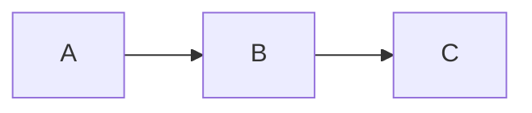

[](https://ci-cd.platypush.tech/blacklight/madblog)

[[TOC]]

A minimal but capable blog and Web framework that you can directly run from a Markdown folder.

## Demos

This project powers the following blogs:

- [Platypush](https://blog.platypush.tech)
- [My personal blog](https://blog.fabiomanganiello.com)

## Installation

### Local installation

```shell
pip install madblog
```

### Docker installation

#### Minimal installation

A minimal installation doesn't include extra plugins, and it should be about 50
MB in size.

##### Pre-built image (recommended)

```bash
docker pull quay.io/blacklight/madblog
docker tag quay.io/blacklight/madblog madblog
```

##### Build from source

```shell
git clone https://git.fabiomanganiello.com/madblog
cd madblog
docker build -f docker/minimal.Dockerfile -t madblog .
```

#### Full installation

Includes all plugins - including LaTeX and Mermaid; &gt; 2 GB in size.

```shell
git clone https://git.fabiomanganiello.com/madblog
cd madblog
docker build -f docker/full.Dockerfile -t madblog .
```

## Usage

```shell
# The application will listen on port 8000 and it will
# serve the current folder
$ madblog
usage: madblog [-h] [--config CONFIG] [--host HOST] [--port PORT] [--debug] [dir]
```

Recommended setup (for clear separation of content, configuration and static
files):

```
.
  -> config.yaml [recommended]
  -> markdown
    -> article-1.md
    -> article-2.md
    -> ...
  -> img [recommended]
    -> favicon.ico
    -> icon.png
    -> image-1.png
    -> image-2.png
    -> ...
```

But the application can run from any folder that contains Markdown files
(including e.g. your Obsidian vault, Nextcloud Notes folder or a git clone).

To run it from Docker:

```shell
docker run -it \
  -p 8000:8000 \
  -v "/path/to/your/config.yaml:/etc/madblog/config.yaml" \
  -v "/path/to/your/content:/data" \
  madblog
```

If you have ActivityPub federation enabled, mount your private key and
(optionally) the ActivityPub data directory for persistence:

```shell
docker run -it \
  -p 8000:8000 \
  -v "/path/to/your/config.yaml:/etc/madblog/config.yaml" \
  -v "/path/to/your/content:/data" \
  -v "/path/to/your/private_key.pem:/etc/madblog/ap_key.pem:ro" \
  -v "/path/to/your/activitypub-data:/data/activitypub" \
  madblog
```

Or pass the configuration directory where `config.yaml` lives as a volume
to let Madblog create a key there on the first start:

```shell
docker run -it \
  -p 8000:8000 \
  -v "/path/to/your/config:/etc/madblog" \
  -v "/path/to/your/content:/data" \
  -v "/path/to/your/activitypub-data:/data/activitypub" \
  madblog
```

Set `activitypub_private_key_path: /etc/madblog/ap_key.pem` in your
`config.yaml`. The key file must be readable only by the owner (`chmod 600`).

## Configuration

See [config.example.yaml](./config.example.yaml) for an example configuration
file, and copy it to `config.yaml` in your blog root directory to customize
your blog.

All the configuration options are also available as environment variables, with
the prefix `MADBLOG_`.

For example, the `title` configuration option can be set through the `MADBLOG_TITLE`
environment variable.

### Webmentions

Webmentions allow other sites to notify your blog when they link to one of your
articles. Madblog exposes a Webmention endpoint and stores inbound mentions under
your `content_dir`.

Webmentions configuration options:

- **Enable/disable**
  - Config file: `enable_webmentions: true|false`
  - Environment variable: `MADBLOG_ENABLE_WEBMENTIONS=1` (enable) or `0` (disable)

- **Site link requirement**
  - Set `link` (or `MADBLOG_LINK`) to the public base URL of your blog.
  - Incoming Webmentions are only accepted if the `target` URL domain matches the
    configured `link` domain.

- **Endpoint**
  - The Webmention endpoint is available at: `/webmentions`.

- **Storage**
  - Inbound Webmentions are stored as Markdown files under:
    `content_dir/mentions/incoming/<post-slug>/`.

See the provided [`config.example.yaml`](./config.example.yaml) file for configuration options.

### Moderation

Madblog supports a shared blocklist that applies to both incoming Webmentions
and ActivityPub interactions. Blocked actors' mentions and activities are
silently rejected (never stored or rendered).

Each entry in the `blocked_actors` list can be:

- **Domain**: e.g. `spammer.example.com` — blocks all URLs/actors from that domain.
- **Full URL**: e.g. `https://mastodon.social/users/spammer` — blocks that exact actor.
- **ActivityPub FQN**: e.g. `@spammer@mastodon.social` or `spammer@mastodon.social` — blocks that federated identity by matching domain + username in the actor URL.
- **Regular expression**: delimited by `/`, e.g. `/spammer\.example\..*/` — matched against the full source URL or actor ID.

```yaml
# config.yaml
blocked_actors:
  - spammer.example.com
  - "@troll@evil.social"
  - /spam-ring\.example\..*/
```

Or via environment variable (comma- or space-separated):

```shell
export MADBLOG_BLOCKED_ACTORS="spammer.example.com,@troll@evil.social"
```

Interactions already stored before a blocklist entry was added are also filtered
at render time, so they will no longer appear on your pages.

For ActivityPub, blocking also affects **outgoing** delivery: followers matching
the blocklist are excluded from fan-out (they will not receive new posts), and
are hidden from the public follower count. The follower records are kept on disk
with a `"blocked"` marker so they can be restored automatically — if you later
remove a blocklist entry that matched a follower, the follower is reinstated on
the next application start.

The blocklist is cached in memory with a 5-minute TTL to avoid filesystem
round-trips during publish.

### View mode

The blog home page supports three view modes:

- **`cards`** (default): A responsive grid of article cards with image, title, date and description.
- **`list`**: A compact list — each entry shows only the title, date and description.
- **`full`**: A scrollable, WordPress-like view with the full rendered content of each article inline.

You can set the default via config file or environment variable:

```yaml
# config.yaml
view_mode: cards  # or "list" or "full"
```

```shell
export MADBLOG_VIEW_MODE=list
```

The view mode can also be overridden at runtime via the `view` query parameter:

```
https://myblog.example.com/?view=list
https://myblog.example.com/?view=full
```

Invalid values are silently ignored and fall back to the configured default.

### Aggregator mode

Madblog can also render external RSS or Atom feeds directly in your blog.

Think of cases like the one where you have multiple blogs over the Web and you
want to aggregate all of their content in one place. Or where you have
"affiliated blogs" run by trusted friends or other people in your organization
and you also want to display their content on your own blog.

Madblog provides a simple way of achieving this by including the
`external_feeds` section in your config file:

```yaml
# config.yaml
external_feeds:
  - https://friendsblog.example.com/feed.atom
  - https://colleaguesblog.example.com/feed.atom
```

## Markdown files

For an article to be correctly rendered, you need to start the Markdown file
with the following metadata header:

```markdown
[//]: # (title: Title of the article)
[//]: # (description: Short description of the content)
[//]: # (image: /img/some-header-image.png)
[//]: # (author: Author Name <https://author.me>)
[//]: # (author_photo: https://author.me/avatar.png)
[//]: # (language: en-US)
[//]: # (published: 2022-01-01)
```

Or, if you want to pass an email rather than a URL for the author:

```markdown
[//]: # (author: Author Name <mailto:email@author.me>)
```

You can also tag your articles:

```markdown
[//]: # (tags: #python, #webdev, #tutorial)
```

Tags declared in the metadata header are shown in the article header as links and
contribute to the tag index available at `/tags`. Hashtags written directly in the
article body (e.g. `#python`) are also detected and rendered as links to the
corresponding tag page.

If these metadata headers are missing, some of them can be inferred
from the file itself:

- `title` is either the first main heading or the file name
- `published` is the creation date of the file
- `author` is inferred from the configured `author` and `author_email`

### Folders

You can organize Markdown files in folders. If multiple folders are present, pages on the home will be grouped by
folders.

## Images

Images are stored under `img`. You can reference them in your articles through the following syntax:

```markdown

```

You can also drop your `favicon.ico` under this folder.

## LaTeX support

LaTeX support requires the following executables available in the `PATH`:

- `latex`
- `dvipng`

Syntax for inline LaTeX:

```markdown
And we can therefore prove that \(c^2 = a^2 + b^2\)
```

Syntax for LaTeX expression on a new line:

```markdown
$$
c^2 = a^2 + b^2
$$
```

## Mermaid diagrams

Madblog supports server-side rendering of [Mermaid](https://mermaid.js.org/)
diagrams. Both light and dark theme variants are rendered at build time and
automatically switch based on the reader's system color scheme preference.

### Installation

#### Option A: pip extra (recommended)

No pre-existing system dependencies required beyond what pip provides:

```shell
pip install madblog[mermaid]
```

This installs a bundled Node.js runtime via
[`nodejs-wheel`](https://pypi.org/project/nodejs-wheel/). The Mermaid CLI is
downloaded automatically on first use via `npx`. The first render of a Mermaid
block will be slower; subsequent renders are cached.

#### Option B: System Node.js

If you already have Node.js installed:

```shell
npm install -g @mermaid-js/mermaid-cli
pip install madblog
```

If neither `mmdc` nor `npx` are available at runtime, Mermaid blocks are
rendered as syntax-highlighted code instead.

### Usage

Use standard fenced code blocks with the `mermaid` language tag:

````markdown

````

## ActivityPub federation

Madblog supports [ActivityPub](https://www.w3.org/TR/activitypub/) federation,
allowing your blog posts to appear on Mastodon, Pleroma, and other fediverse
platforms. Followers receive new and updated articles directly in their timelines.

It uses [Pubby](https://git.fabiomanganiello.com/pubby) (also developed by me,
and initially developed for this project) to easily add ActivityPub bindings to
the Web application.

Enable it in your `config.yaml`:

```yaml
enable_activitypub: true
# It will be created if it doesn't exist
activitypub_private_key_path: /path/to/private_key.pem
```

Or via environment variables:

```shell
export MADBLOG_ENABLE_ACTIVITYPUB=1
export MADBLOG_ACTIVITYPUB_PRIVATE_KEY_PATH=/path/to/private_key.pem
```

### Using a different domain for your ActivityPub handle

Madblog uses the configured `link` as the public base URL for ActivityPub.

That means:

- The actor handle advertised through WebFinger will be:
  `@activitypub_username@<domain from link>`.
- Actor/object IDs (e.g. `/ap/actor`, `/article/<slug>`) will also be built from
  `link`.

Madblog provides two optional overrides:

- **`activitypub_link`**: Overrides where the ActivityPub actor and objects
  *live* (canonical IDs like `https://<...>/ap/actor`). This is what remote
  instances like Mastodon will typically treat as the authoritative identity.
- **`activitypub_domain`**: Overrides only the WebFinger `acct:` domain
  advertised for the handle (i.e. `acct:user@domain`). This controls how people
  discover the actor when they type `@user@domain`.

In the simplest case, `activitypub_domain` can be inferred from
`activitypub_link` and you only need `activitypub_link`.

If you want the blog to be *browsed* at `https://blog.example.com` and keep
`link` unchanged, but you want the fediverse handle to be `@blog@example.com`,
set:

```yaml
# Keep your canonical blog URL
link: https://blog.example.com

# Publish the ActivityPub actor and objects on a different base URL
activitypub_link: https://example.com

# Optional: if omitted, the handle domain defaults to the hostname of
# activitypub_link
activitypub_domain: example.com

# Optional: what the UI header “Home” link points to
home_link: https://blog.example.com

enable_activitypub: true
activitypub_username: blog
```

And then serve the same Madblog instance on both hostnames (typical setup is a
reverse-proxy with two server names pointing to the same upstream).

In this configuration, `example.com` must serve WebFinger for the handle.
You can keep serving `example.com` with a different application and only
delegate the *discovery endpoints* to Madblog (or implement them yourself).
At minimum, `example.com` must serve:

- `/.well-known/webfinger` (required for `@user@example.com` discovery)

Some remote software may also query:

- `/.well-known/nodeinfo`

In this split-domain setup:

- `link` remains the blog’s canonical base URL.
- `activitypub_link` determines the actor/object IDs.
- `activitypub_domain` determines the WebFinger `acct:` domain.
- Requests to `https://example.com/.well-known/webfinger` and
  `https://example.com/ap/` should be routed to the Madblog instance.

Example (nginx, simplified):

```nginx
upstream madblog {
    server 127.0.0.1:8000;
}

server {
    listen 443 ssl;
    server_name example.com blog.example.com;

    location / {
        proxy_set_header Host $host;
        proxy_set_header X-Forwarded-Proto $scheme;
        proxy_set_header X-Forwarded-For $proxy_add_x_forwarded_for;
        proxy_pass http://madblog;
    }
}
```

Notes:

- If `example.com` does not route to Madblog, remote instances will try to fetch
  `https://example.com/.well-known/webfinger`, `https://example.com/ap/actor`,
  etc., and federation/discovery will fail.
- If you prefer `example.com` to redirect browsers to `blog.example.com`, keep
  the federation endpoints working on `example.com` (no redirect) and only
  redirect other routes (or do it at the CDN layer while exempting at least
  `/.well-known/*`).

Example (nginx, split-domain: proxy only discovery endpoints on `example.com`):

```nginx
upstream madblog {
    server 127.0.0.1:8000;
}

server {
    listen 443 ssl;
    server_name example.com;

    # Your main site continues to serve everything else
    location / {
        proxy_pass http://your_main_site;
    }

    # Delegate fediverse discovery to Madblog
    location = /.well-known/webfinger {
        proxy_set_header Host $host;
        proxy_set_header X-Forwarded-Proto $scheme;
        proxy_set_header X-Forwarded-For $proxy_add_x_forwarded_for;
        proxy_pass http://madblog;
    }

    location /ap/ {
        proxy_set_header Host $host;
        proxy_set_header X-Forwarded-Proto $scheme;
        proxy_set_header X-Forwarded-For $proxy_add_x_forwarded_for;
        proxy_pass http://madblog;
    }

    location = /.well-known/nodeinfo {
        proxy_set_header Host $host;
        proxy_set_header X-Forwarded-Proto $scheme;
        proxy_set_header X-Forwarded-For $proxy_add_x_forwarded_for;
        proxy_pass http://madblog;
    }

    # Required for URL-based article search on Mastodon.
    # When someone searches for an article URL on the blog domain, Madblog
    # redirects AP clients to the canonical object URL on the AP domain.
    # This proxy rule lets Mastodon follow that redirect and fetch the
    # article's AP representation.
    location /article/ {
        proxy_set_header Host $host;
        proxy_set_header X-Forwarded-Proto $scheme;
        proxy_set_header X-Forwarded-For $proxy_add_x_forwarded_for;
        proxy_pass http://madblog;
    }
}
```

**Note on article URL search:** When `activitypub_link` differs from `link`,
ActivityPub object IDs live on the `activitypub_link` domain (required by
Mastodon's origin check during inbox delivery). When an AP client fetches an
article from the blog domain, Madblog automatically redirects to the canonical
URL on the `activitypub_link` domain. The `/article/` proxy rule above is
needed so that Mastodon can follow the redirect and resolve the article.

If you can’t/won’t proxy, you can also implement WebFinger in your main site:
respond to `GET /.well-known/webfinger?resource=acct:blog@example.com` with a
JSON document that links to the actor URL hosted on `blog.example.com` (the
`rel="self"` link is the important one).

### Mentions

You can mention fediverse users in your articles using the `@user@domain`
syntax. Mentions are rendered as links and delivered as proper ActivityPub
mentions — the mentioned user will receive a notification on their instance.

```markdown
Great article by @alice@mastodon.social about federation!
```

### Configuration options

| Option | Env var | Default | Description |
|--------|---------|---------|-------------|
| `activitypub_object_type` | `MADBLOG_ACTIVITYPUB_OBJECT_TYPE` | `Note` | ActivityPub object type (`Note` or `Article`). `Note` renders inline on Mastodon; `Article` shows as a link preview. |
| `activitypub_description_only` | `MADBLOG_ACTIVITYPUB_DESCRIPTION_ONLY` | `false` | Only send the article description instead of the full rendered content. |
| `activitypub_link` | `MADBLOG_ACTIVITYPUB_LINK` | unset (uses `link`) | Base URL used for ActivityPub actor/object IDs (e.g. actor `id` is `<base>/ap/actor`). Set this if you want the canonical ActivityPub identity to live on a different hostname than `link`. |
| `activitypub_username` | `MADBLOG_ACTIVITYPUB_USERNAME` | `blog` | Fediverse username for the blog actor. |
| `activitypub_domain` | `MADBLOG_ACTIVITYPUB_DOMAIN` | unset (uses `activitypub_link` hostname, else `link` hostname) | Domain used in WebFinger `acct:` handle discovery (e.g. `acct:blog@example.com`). This affects discovery/handle only, not where ActivityPub endpoints are hosted. |
| `activitypub_profile_field_name` | `MADBLOG_ACTIVITYPUB_PROFILE_FIELD_NAME` | `Blog` | Label used for the primary ActivityPub profile field that points to your blog URL (`link`). |
| `activitypub_profile_fields` | N/A | empty mapping | Additional profile fields to advertise on the ActivityPub actor as a name->value mapping. If a value is an http(s) URL it will be rendered as a `rel="me"` link. |
| `activitypub_manually_approves_followers` | `MADBLOG_ACTIVITYPUB_MANUALLY_APPROVES_FOLLOWERS` | `false` | Require manual approval for new followers. |
| `activitypub_quote_control` | `MADBLOG_ACTIVITYPUB_QUOTE_CONTROL` | `public` | Quote policy for ActivityPub posts. Mastodon will refuse quote-boosts unless set to `public`. |

### Mastodon-compatible API

When ActivityPub is enabled, Madblog exposes a read-only subset of the
[Mastodon REST API](https://docs.joinmastodon.org/methods/) so that
Mastodon-compatible clients and crawlers can discover the instance, look up the
blog actor, list published statuses, and search content.

No additional configuration is needed — the API is automatically registered
alongside the ActivityPub endpoints and derives all settings from the existing
`config.yaml`.

| Method | Path | Description |
|--------|------|-------------|
| `GET` | `/api/v1/instance` | Instance metadata (v1) |
| `GET` | `/api/v2/instance` | Instance metadata (v2) |
| `GET` | `/api/v1/instance/peers` | Known peer domains |
| `GET` | `/api/v1/accounts/lookup` | Resolve `acct:user@domain` to Account |
| `GET` | `/api/v1/accounts/:id` | Account by ID (`1` = local actor) |
| `GET` | `/api/v1/accounts/:id/statuses` | Paginated statuses |
| `GET` | `/api/v1/accounts/:id/followers` | Paginated followers |
| `GET` | `/api/v1/statuses/:id` | Single status by ID |
| `GET` | `/api/v1/tags/:tag` | Tag entity with 7-day usage history |
| `GET` | `/api/v2/search` | Search accounts, hashtags, and statuses |
| `GET` | `/nodeinfo/2.0[.json]` | NodeInfo 2.0 aliases |
| `GET` | `/nodeinfo/2.1.json` | NodeInfo 2.1 `.json` alias |

## Feed syndication

Feeds for the blog are provided under the `/feed.<type>` URL, with `type` one of `atom` or `rss` (e.g. `/feed.atom` or
`/feed.rss`).

By default, the whole HTML-rendered content of an article is returned under the entry content.

If you only want to include the short description of an article in the feed, use `/feed.<type>?short` instead.

You can also specify the `?limit=n` parameter to limit the number of entries returned in the feed.

For backwards compatibility, `/rss` is still available as a shortcut to `/feed.rss`.

If you want the short feed (i.e. without the fully rendered article as a
description) to be always returned, then you can specify `short_feed=true` in
your configuration.
