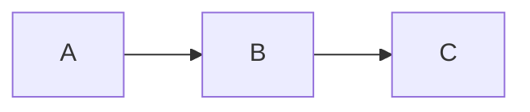

# madblog

[](https://ci-cd.platypush.tech/blacklight/madblog)

A minimal but capable blog and Web framework that you can directly run from a Markdown folder.

## Demos

This project powers the following blogs:

- [Platypush](https://blog.platypush.tech)
- [My personal blog](https://blog.fabiomanganiello.com)

## Installation

### Local installation

```shell
pip install madblog
```

### Docker installation

#### Minimal installation

A minimal installation doesn't include extra plugins, and it should be about 50
MB in size.

##### Pre-built image (recommended)

```bash
docker pull quay.io/blacklight/madblog
docker tag quay.io/blacklight/madblog madblog
```

##### Build from source

```shell
git clone https://git.fabiomanganiello.com/madblog
cd madblog
docker build -f docker/minimal.Dockerfile -t madblog .
```

#### Full installation

Includes all plugins - including ActivityPub, LaTeX and Mermaid; &gt; 2 GB in size.

```shell
git clone https://git.fabiomanganiello.com/madblog
cd madblog
docker build -f docker/full.Dockerfile -t madblog .
```

## Usage

```shell
# The application will listen on port 8000 and it will
# serve the current folder
$ madblog
usage: madblog [-h] [--config CONFIG] [--host HOST] [--port PORT] [--debug] [dir]
```

Recommended setup (for clear separation of content, configuration and static
files):

```
.
  -> config.yaml [recommended]
  -> markdown
    -> article-1.md
    -> article-2.md
    -> ...
  -> img [recommended]
    -> favicon.ico
    -> icon.png
    -> image-1.png
    -> image-2.png
    -> ...
```

But the application can run from any folder that contains Markdown files
(including e.g. your Obsidian vault, Nextcloud Notes folder or a git clone).

To run it from Docker:

```shell
docker run -it \
  -p 8000:8000 \
  -v "/path/to/your/config.yaml:/etc/madblog/config.yaml" \
  -v "/path/to/your/content:/data" \
  madblog
```

If you have ActivityPub federation enabled, mount your private key and
(optionally) the ActivityPub data directory for persistence:

```shell
docker run -it \
  -p 8000:8000 \
  -v "/path/to/your/config.yaml:/etc/madblog/config.yaml" \
  -v "/path/to/your/content:/data" \
  -v "/path/to/your/private_key.pem:/etc/madblog/ap_key.pem:ro" \
  -v "/path/to/your/activitypub-data:/data/activitypub" \
  madblog
```

Or pass the configuration directory where `config.yaml` lives as a volume
to let Madblog create a key there on the first start:

```shell
docker run -it \
  -p 8000:8000 \
  -v "/path/to/your/config:/etc/madblog" \
  -v "/path/to/your/content:/data" \
  -v "/path/to/your/activitypub-data:/data/activitypub" \
  madblog
```

Set `activitypub_private_key_path: /etc/madblog/ap_key.pem` in your
`config.yaml`. The key file must be readable only by the owner (`chmod 600`).

## Configuration

See [config.example.yaml](./config.example.yaml) for an example configuration
file, and copy it to `config.yaml` in your blog root directory to customize
your blog.

All the configuration options are also available as environment variables, with
the prefix `MADBLOG_`.

For example, the `title` configuration option can be set through the `MADBLOG_TITLE`
environment variable.

### Webmentions

Webmentions allow other sites to notify your blog when they link to one of your
articles. Madblog exposes a Webmention endpoint and stores inbound mentions under
your `content_dir`.

Webmentions configuration options:

- **Enable/disable**
  - Config file: `enable_webmentions: true|false`
  - Environment variable: `MADBLOG_ENABLE_WEBMENTIONS=1` (enable) or `0` (disable)

- **Site link requirement**
  - Set `link` (or `MADBLOG_LINK`) to the public base URL of your blog.
  - Incoming Webmentions are only accepted if the `target` URL domain matches the
    configured `link` domain.

- **Endpoint**
  - The Webmention endpoint is available at: `/webmentions`.

- **Storage**
  - Inbound Webmentions are stored as Markdown files under:
    `content_dir/mentions/incoming/<post-slug>/`.

See the provided [`config.example.yaml`](./config.example.yaml) file for configuration options.

### View mode

The blog home page supports three view modes:

- **`cards`** (default): A responsive grid of article cards with image, title, date and description.
- **`list`**: A compact list — each entry shows only the title, date and description.
- **`full`**: A scrollable, WordPress-like view with the full rendered content of each article inline.

You can set the default via config file or environment variable:

```yaml
# config.yaml
view_mode: cards  # or "list" or "full"
```

```shell
export MADBLOG_VIEW_MODE=list
```

The view mode can also be overridden at runtime via the `view` query parameter:

```
https://myblog.example.com/?view=list
https://myblog.example.com/?view=full
```

Invalid values are silently ignored and fall back to the configured default.

### Aggregator mode

Madblog can also render external RSS or Atom feeds directly in your blog.

Think of cases like the one where you have multiple blogs over the Web and you
want to aggregate all of their content in one place. Or where you have
"affiliated blogs" run by trusted friends or other people in your organization
and you also want to display their content on your own blog.

Madblog provides a simple way of achieving this by including the
`external_feeds` section in your config file:

```yaml
# config.yaml
external_feeds:
  - https://friendsblog.example.com/feed.atom
  - https://colleaguesblog.example.com/feed.atom
```

## Markdown files

For an article to be correctly rendered, you need to start the Markdown file
with the following metadata header:

```markdown
[//]: # (title: Title of the article)
[//]: # (description: Short description of the content)
[//]: # (image: /img/some-header-image.png)
[//]: # (author: Author Name <https://author.me>)
[//]: # (author_photo: https://author.me/avatar.png)
[//]: # (language: en-US)
[//]: # (published: 2022-01-01)
```

Or, if you want to pass an email rather than a URL for the author:

```markdown
[//]: # (author: Author Name <mailto:email@author.me>)
```

You can also tag your articles:

```markdown
[//]: # (tags: #python, #webdev, #tutorial)
```

Tags declared in the metadata header are shown in the article header as links and
contribute to the tag index available at `/tags`. Hashtags written directly in the
article body (e.g. `#python`) are also detected and rendered as links to the
corresponding tag page.

If these metadata headers are missing, some of them can be inferred
from the file itself:

- `title` is either the first main heading or the file name
- `published` is the creation date of the file
- `author` is inferred from the configured `author` and `author_email`

### Folders

You can organize Markdown files in folders. If multiple folders are present, pages on the home will be grouped by
folders.

## Images

Images are stored under `img`. You can reference them in your articles through the following syntax:

```markdown

```

You can also drop your `favicon.ico` under this folder.

## LaTeX support

LaTeX support requires the following executables available in the `PATH`:

- `latex`
- `dvipng`

Syntax for inline LaTeX:

```markdown
And we can therefore prove that \(c^2 = a^2 + b^2\)
```

Syntax for LaTeX expression on a new line:

```markdown
$$
c^2 = a^2 + b^2
$$
```

## Mermaid diagrams

Madblog supports server-side rendering of [Mermaid](https://mermaid.js.org/)
diagrams. Both light and dark theme variants are rendered at build time and
automatically switch based on the reader's system color scheme preference.

### Installation

#### Option A: pip extra (recommended)

No pre-existing system dependencies required beyond what pip provides:

```shell
pip install madblog[mermaid]
```

This installs a bundled Node.js runtime via
[`nodejs-wheel`](https://pypi.org/project/nodejs-wheel/). The Mermaid CLI is
downloaded automatically on first use via `npx`. The first render of a Mermaid
block will be slower; subsequent renders are cached.

#### Option B: System Node.js

If you already have Node.js installed:

```shell
npm install -g @mermaid-js/mermaid-cli
pip install madblog
```

If neither `mmdc` nor `npx` are available at runtime, Mermaid blocks are
rendered as syntax-highlighted code instead.

### Usage

Use standard fenced code blocks with the `mermaid` language tag:

````markdown

````

## RSS syndication

Feeds for the blog are provided under the `/feed.<type>` URL, with `type` one of `atom` or `rss` (e.g. `/feed.atom` or
`/feed.rss`).

By default, the whole HTML-rendered content of an article is returned under the entry content.

If you only want to include the short description of an article in the feed, use `/feed.<type>?short` instead.

You can also specify the `?limit=n` parameter to limit the number of entries returned in the feed.

For backwards compatibility, `/rss` is still available as a shortcut to `/feed.rss`.

If you want the short feed (i.e. without the fully rendered article as a
description) to be always returned, then you can specify `short_feed=true` in
your configuration.
